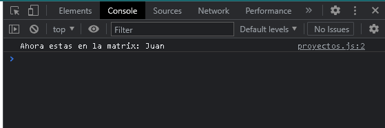

# PROGRAMACION IV TALLER JAVASCRIPT 

# PARTICIPANTES
1. Juan Esteban Arbeláez Duque
2. Juan Felipe Montoya Arango

# EJERCICIO 1


```javascript
nombre = prompt("Tu nombre: ");
console.log("Ahora estas en la matrix: " + nombre);
```
## SALIDAD EJERCICIO 1 



